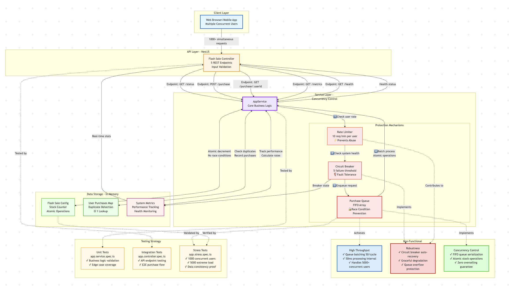

## Requirements

You know how when there's a limited product launch and the website crashes because everyone hits "buy" at once? Or worse - they sell more items than they actually have? That's what this fixes.

**What this system guarantees:**
- ✅ **No overselling** - If there are 100 items, exactly 100 people get them (not 101, not 99)
- ✅ **Fair** - First come, first served via queue system
- ✅ **Stable** - Doesn't crash when 5000 people hit it simultaneously
- ✅ **Accurate** - Every purchase is tracked correctly, no race conditions

## System Architecture



## How I Built This To Handle Load

Most systems break under extreme concurrency. Here's how I solved it:

### 1. Queue-Based Processing
```
Thousands of Users → Queue → Process in Batches → Atomic Purchase
```
**The Problem**: When 1000 users click "buy" simultaneously, race conditions cause overselling.

**The Solution**: 
- All requests enter a FIFO queue (first in, first out)
- Single background processor handles them one batch at a time
- Prevents "two people buying the last item" bug

**Why It Works**: Only ONE processor runs at a time (`isProcessingQueue` lock), eliminating race conditions.

### 2. Atomic Operations
```typescript
// This happens all at once - no partial updates possible
stock--;
userPurchases.set(userId, { success: true });
```
**The Problem**: Stock decrements and purchase records could get out of sync.

**The Solution**:
- Stock decrement + purchase recording happen together
- Either both succeed or both fail
- No partial states = perfect consistency

**Why It Works**: JavaScript single-threaded execution + single processor = atomic operations.

### 3. Circuit Breaker
**The Problem**: Cascading failures can crash the entire system.

**The Solution**:
- **CLOSED**: Normal operation, accepts all requests
- **OPEN**: After 5 failures, fast-fail everything for 30 seconds
- **HALF_OPEN**: Test with one request, then decide CLOSED or OPEN

**Why It Works**: Prevents bad requests from overwhelming the system during outages.

### 4. Rate Limiting
**The Problem**: Bots or aggressive users spam requests, starving legitimate users.

**The Solution**:
- Max 10 requests per minute per user
- Sliding window tracking (last 60 seconds)
- Old timestamps automatically cleaned up

**Why It Works**: Fair access for everyone, prevents system abuse.

### 5. Real-Time Monitoring
**The Problem**: Can't optimize what you can't measure.

**The Solution**:
- Success rates, queue depth, processing times tracked
- Health status: `healthy` → `degraded` → `unhealthy`
- Exposed via `/metrics` and `/health` endpoints

**Why It Works**: Visibility enables proactive scaling and debugging.

## 🔄 Complete Request Flow

Here's exactly what happens when you try to buy something:

```
User Request
    ↓
attemptPurchase(userId)
    ↓
[1. Circuit Breaker Check]
    ├─ ❌ OPEN → Fast fail (503: System unavailable)
    └─ ✅ CLOSED/HALF_OPEN → Continue
    ↓
[2. Rate Limit Check]
    ├─ ❌ >10 req/min → "Too many requests" (429)
    └─ ✅ Under limit → Continue
    ↓
[3. Quick Validations]
    ├─ ❌ Sale not active → Reject (400)
    ├─ ❌ Already purchased → Reject (409)
    ├─ ❌ No stock → Reject (400)
    └─ ✅ All checks pass → Continue
    ↓
[4. Queue Request]
    ├─ Add to purchaseQueue (FIFO)
    ├─ Check queue size (max 10,000)
    └─ Wake processor if sleeping
    ↓
[Background: processQueue() - Runs every 10ms]
    ↓
[5. Lock Processing]
    └─ Set isProcessingQueue = true
    ↓
[6. Batch Processing]
    └─ Grab up to 50 requests
    ↓
[7. For Each Request]
    ↓
    processPurchaseAtomic(userId)
        ↓
    [8. Re-validate Everything]
        ├─ Sale still active?
        ├─ User didn't purchase while waiting?
        └─ Stock still available?
        ↓
    [9. ATOMIC OPERATION]
        ├─ availableStock--
        └─ userPurchases.set(userId, {success: true})
        ↓
    [10. Resolve Promise]
        └─ Return success/failure to user
    ↓
[11. Unlock Processing]
    └─ isProcessingQueue = false
    ↓
[12. Continue If Needed]
    └─ More in queue? → Loop back to step 5
```

### Flow Breakdown

**Early Rejection (Steps 1-3)**
- Circuit breaker and rate limiter fail fast
- Prevents unnecessary queuing of bad requests
- Saves CPU and memory

**Optimistic Validation (Step 3)**
- Quick checks before queuing
- Reduces queue load
- Most invalid requests rejected here

**Queueing (Step 4)**
- Fair ordering (FIFO)
- Bounded size prevents memory explosion
- Async promise returned to caller

**Batch Processing (Steps 5-7)**
- Processes 50 at a time for efficiency
- Single processor prevents race conditions
- Runs every 10ms for low latency

**Pessimistic Validation (Step 8)**
- Re-check everything inside atomic section
- Things may have changed while in queue
- Final guarantee of data consistency

**Atomic Operation (Step 9)**
- Critical section - no interruption possible
- Both operations succeed or both fail
- Zero chance of overselling

## Getting Started

### You Need
- Node.js 18+ 
- npm

### Run It
```bash
# Install stuff
npm install

# Start it (auto-reloads when you change code)
npm run start:dev

# API runs at: http://localhost:3001
```

## The API

### Check Sale Status
```http
GET /flash-sale/status
```
See if sale is active, how many items left, etc.

**Response:**
```json
{
  "status": "active",
  "availableStock": 75,
  "totalStock": 100,
  "soldOut": false,
  "queueLength": 12,
  "systemHealth": "healthy"
}
```

### Try To Buy Something
```http
POST /flash-sale/purchase

{
  "userId": "user123"
}
```

**Success:**
```json
{
  "success": true,
  "message": "Purchase successful! You have secured your item."
}
```

**Common Errors:**
- `400`: "Flash sale has ended"
- `400`: "Product is sold out"
- `409`: "You have already purchased this item"
- `429`: "Too many requests. Please slow down."
- `503`: "System is overloaded. Please try again later."

### Check what I purchased?
```http
GET /flash-sale/purchase/:userId
```

```json
{
  "purchased": true,
  "message": "You have successfully secured an item",
  "timestamp": 1704067200000
}
```

### System Metrics
```http
GET /flash-sale/metrics
```

```json
{
  "totalRequests": 1500,
  "successfulPurchases": 100,
  "failedPurchases": 1400,
  "currentQueueSize": 25,
  "averageProcessingTime": 45.23,
  "successRate": "6.67%",
  "circuitBreakerState": "CLOSED"
}
```

### Health Check
```http
GET /flash-sale/health
```

```json
{
  "status": "healthy",
  "uptime": 3600.5,
  "circuitBreaker": "CLOSED",
  "queueLength": 5,
  "availableStock": 50
}
```

## Testing

### Run Tests
```bash
# Run ALL tests (unit + integration + stress)
# This runs app.service.spec.ts, app.controller.spec.ts, AND app.stress.spec.ts
npm run test

# With coverage report
npm run test:cov

# Watch mode (re-runs on file changes)
npm run test:watch

# Run specific test file
npm run test -- app.service.spec.ts      # Just unit tests
npm run test -- app.controller.spec.ts   # Just integration tests  
npm run test -- app.stress.spec.ts       # Just stress tests
```

### What Each Test File Does

**`app.service.spec.ts`** - Unit Tests
- Tests business logic in isolation
- Purchase validation, rate limiting, queue processing
- Circuit breaker behavior, metrics tracking
- Fast - runs in milliseconds

**`app.controller.spec.ts`** - Integration Tests  
- Tests API endpoints end-to-end
- HTTP requests/responses
- Error handling and status codes
- Data consistency across the full stack

**`app.stress.spec.ts`** - Stress Tests
This is where we simulate real load:

**1000 concurrent users, 100 items**
```bash
npm run test -- app.stress.spec.ts --testNamePattern="1000 concurrent"
```
- Exactly 100 purchases succeed (no overselling!)
- 900 properly rejected
- No duplicate purchases
- System stays responsive

**5000 concurrent users, 200 items** (extreme!)
```bash
npm run test -- app.stress.spec.ts --testNamePattern="extreme load"
```
- Tests the breaking point
- Verifies graceful failure
- Checks memory doesn't leak

**Rate limiting stress test**
```bash
npm run test -- app.stress.spec.ts --testNamePattern="rate limit"
```
- One user spamming 50 requests
- Verifies they get blocked after 10

## Configuration

### Change Flash Sale Settings at backend
```typescript
const now = new Date();
const endTime = new Date(now.getTime() + 60 * 60 * 1000);  // Runs for 1 hour

service.configureFlashSale({
  startTime: new Date(now.getTime() - 60000), // Started a minute ago
  endTime: endTime,
  totalStock: 100,
});
```

### System Limits
```typescript
maxQueueSize: 10000,          // Max concurrent requests
maxRequestsPerMinute: 10,     // Rate limit per user
failureThreshold: 5,          // Circuit breaker trigger
resetTimeout: 30000,          // Recovery time (30s)
batchSize: 50,               // Requests per batch
```

### Code Structure
```
src/
├── app.controller.ts      # REST API endpoints & HTTP handling
├── app.service.ts         # Core business logic & algorithms  
├── app.controller.spec.ts # Integration & API testing
├── app.service.spec.ts    # Unit testing & logic validation
├── app.stress.spec.ts     # Performance & load testing
└── main.ts               # Application bootstrap
```